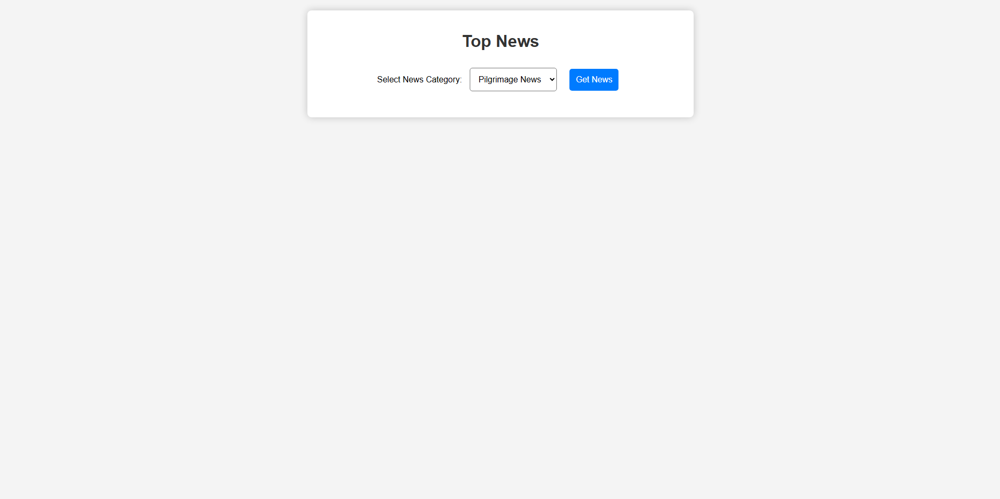
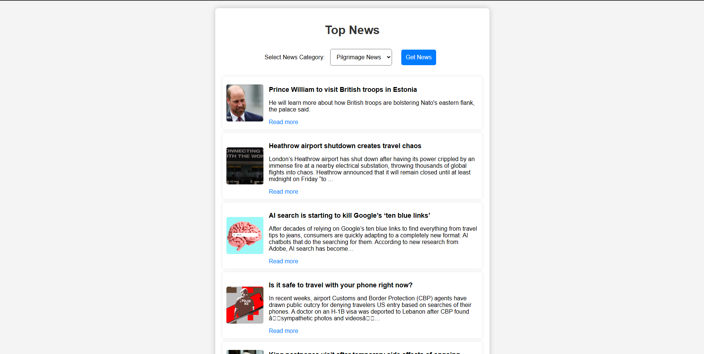

# 📰 News Fetch Bot

## 🚀 Overview
The **News Fetch Bot** is a simple yet powerful web application that fetches the latest news articles based on user-selected categories. Built using **Flask**, it integrates with the NewsAPI to provide real-time news updates. Users can choose from different categories like **Pilgrimage** and **Devotional** to get relevant news articles instantly.

## 🎯 Features
✅ **Live News Fetching** – Get real-time news updates filtered by category.  
✅ **Interactive UI** – A clean, responsive, and user-friendly interface.  
✅ **Category-based Filtering** – Select from pre-defined categories to get relevant news.  
✅ **Direct News Links** – Read full articles by clicking on the links.  
✅ **Fast & Lightweight** – Optimized for performance and quick responses.  

## 🏗️ Tech Stack
🟢 **Backend:** Flask (Python)  
🎨 **Frontend:** HTML, CSS, JavaScript  
🔗 **API:** NewsAPI.org  
📦 **Libraries:** Requests, Flask, JSON  

---

## 📁 Folder Structure
```
news_app/
│── app.py                 # Main Flask application
│── config.py              # API key & config
│── requirements.txt       # Dependencies
│── static/                # Static assets (CSS, Images, JS)
│   ├── styles.css         # Styling
│   ├── script.js          # Frontend logic
│── templates/             # HTML templates
│   ├── index.html         # Main page
│── news_fetch/            # News fetching logic
│   ├── fetch_news.py      # API integration
```

---

## 🛠️ Setup & Installation
### 🔹 Prerequisites
- Python 3.x installed
- Flask & dependencies
- A valid API key from [NewsAPI](https://newsapi.org/)

### 📥 Installation Steps
1️⃣ Clone the repository:
```bash
 git clone https://github.com/your-username/news-fetch-bot.git
 cd news-fetch-bot
```

2️⃣ Install dependencies:
```bash
pip install -r requirements.txt
```

3️⃣ Set up `config.py` with your NewsAPI key:
```python
API_KEY = "your_api_key_here"
NEWS_API_URL = "https://newsapi.org/v2/everything"
```

4️⃣ Run the Flask application:
```bash
python app.py
```

5️⃣ Open your browser and visit:
```
http://127.0.0.1:5000/
```

---

## 🎨 Screenshots
### 🌟 Homepage


### 📜 Pilgrimage News


### 📜 Devetional News

---

## 📌 API Endpoint
- **POST `/get_news`**
  - **Request:**
    ```json
    { "category": "pilgrimage" }
    ```
  - **Response:**
    ```json
    {
      "status": "ok",
      "articles": [
        {
          "title": "Article Title",
          "description": "Short summary...",
          "url": "https://newslink.com"
        }
      ]
    }
    ```

---

## 🏆 Contributions
Want to improve this project? Contributions are welcome! Follow these steps:
1️⃣ **Fork** the repo
2️⃣ **Create a feature branch** (`feature-new`)
3️⃣ **Commit changes**
4️⃣ **Push and create a PR**

---

## 📞 Contact
💡 Created by **Pradyumna Digraskar**  
📧 Email: [pradyumnadigraskar11@gmail.com](mailto:pradyumnadigraskar11@gmail.com)  
🔗 GitHub: [https://github.com/pradyumnadigraskar) ](https://github.com/pradyumnadigraskar)  


